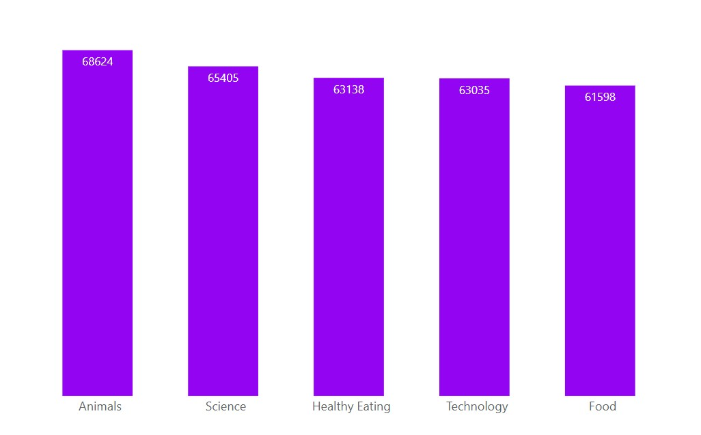
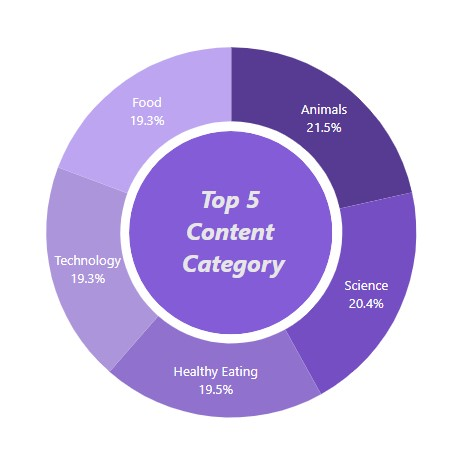
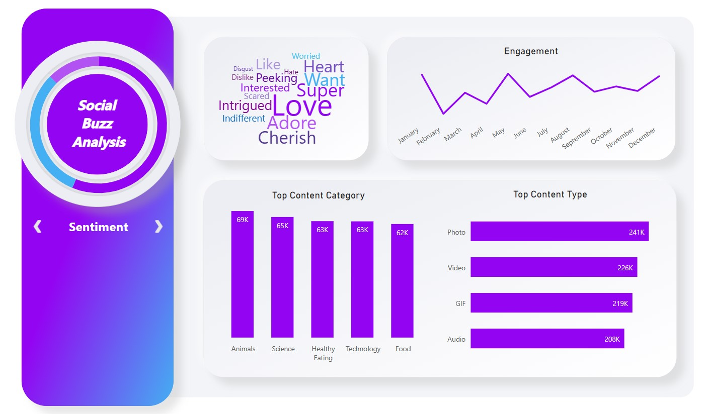
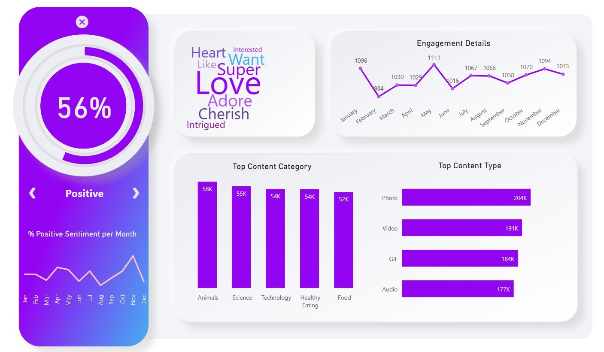
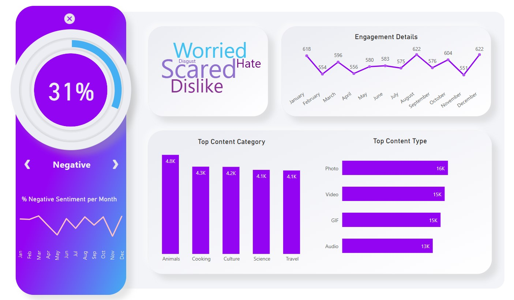
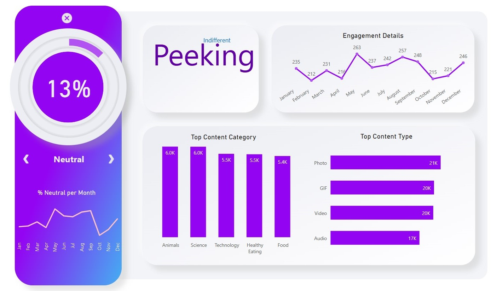

# Social Buzz Analysis

## Contents

- [Description](#description)
- [Project Details](#project-details)
- [Key Performance Indicators (KPIs)](#key-performance-indicators-kpis)
  - [Calculated KPIs](#kpis-that-were-calculated)
- [Data Collection](#data-collection)
- [Data Cleaning Process](#data-cleaning-process)
- [Skills](#skills)
- [Tech Stack](#tech-stack)
- [Insights \& Recommendations](#insights--recommendations)
- [Dashboard](#dashboard)
- [Conclusion](#conclusion)

## Description

Conducted an analysis of Social Buzz's content categories to determine the top 5 categories with the highest aggregate popularity, and presented a Power BI report to the management team in order to optimize their content creation strategy and scale their business effectively.

## Project Details

The objective of this project is to analyze Social Buzz's content categories and determine the top 5 categories with the highest aggregate popularity. Social Buzz is a social media and content creation company based in San Francisco, founded in 2010. They have over 500 million active users each month, and their platform emphasizes content by keeping all users anonymous and tracking user reactions to every piece of content. Every day over 100,000 pieces of content, ranging from text, images, videos and GIFs are posted. All of this data is highly unstructured and requires extremely sophisticated and expensive technology to manage and maintain. There are over 100 ways that users can react to content, spanning beyond the traditional reactions of likes, dislikes, and comments. This ensures that trending content, as opposed to individual users, is at the forefront of user feeds. To achieve their goal, I worked with three datasets: Content, Reaction, and ReactionTypes.

The Content dataset contains unique IDs of the uploaded content, user IDs, the type of content uploaded, the category relevant to the content, and the URL where the content is stored. The Reaction dataset contains unique IDs of the content, user IDs, the type of reaction given, and the date and time of the reaction. The ReactionTypes dataset contains the type of reaction, whether it is considered positive, negative, or neutral, and a score that quantifies how "popular" each reaction is.

To determine the top 5 categories with the highest aggregate popularity, I added up the scores of each reaction type for each category. Since popularity is quantified by the "Score" given to each reaction type, I needed data showing the content ID, category, content type, reaction type, and reaction score. I then aggregated the data by category and sum up the scores for each reaction type.

Before beginning to analyze the data, I performed data cleaning to remove any rows with missing values, change the data type of some values within a column, and remove columns that are not relevant to this task. Once I have cleaned the data, I calculated KPIs such as positive sentiment, negative sentiment, neutral sentiment, percentage positive sentiment, percentage negative sentiment, and percentage neutral sentiment.

The final deliverable was a Power BI report detailing the top 5 content categories with the highest aggregate popularity, along with the KPIs calculated for each category. This report will be presented to Social Buzz's management team, who will use the insights gained to optimize their content creation strategy and scale their business effectively.

## Key Performance Indicators (KPIs)

KPIs are measurable values that organizations use to track and evaluate their progress towards achieving specific business objectives. They are used to measure performance over time and allow organizations to make data-driven decisions based on actual results. KPIs are specific to the objectives of an organization or department and can be qualitative or quantitative. They are important metrics that help organizations identify areas for improvement, set targets for future performance, and track their success in meeting their goals.

### KPIs that were calculated:

- **Positive Sentiment**: The number of times a particular sentiment is classified as positive in the given dataset or context. This could be based on the presence of specific words, phrases, or other indicators that suggest a positive sentiment.

- **Negative Sentiment**: The number of times a particular sentiment is classified as negative in the given dataset or context. This could be based on the presence of specific words, phrases, or other indicators that suggest a negative sentiment.

- **Neutral Sentiment**: The number of times a particular sentiment is classified as neutral in the given dataset or context. This could be based on the absence of any clear indicators of positive or negative sentiment or the presence of indicators that balance each other out.

- **Percentage Positive Sentiment**: The proportion of all sentiments in a given dataset or context that are classified as positive. This is calculated by dividing the number of positive sentiment instances by the total number of sentiment instances and multiplying by 100.
> % Positive Sentiment = (Number of Positive sentiment instances / Total number of sentiment instances) x 100%

- **Percentage Negative Sentiment**: The proportion of all sentiments in a given dataset or context that are classified as negative. This is calculated by dividing the number of negative sentiment instances by the total number of sentiment instances and multiplying by 100.
> % Negative Sentiment = (Number of Negative sentiment instances / Total number of sentiment instances) x 100%

- **Percentage Neutral Sentiment**: The proportion of all sentiments in a given dataset or context that are classified as neutral. This is calculated by dividing the number of neutral sentiment instances by the total number of sentiment instances and multiplying by 100.
> % Neutral Sentiment = (Number of Neutral sentiment instances / Total number of sentiment instances) x 100%

## Data Collection

The dataset was provided as a CSV file by Accenture from their client Social Buzz during Accenture Data Analytics and Visualization Virtual Experience, which includes three tables: Content, Reaction, and ReactionTypes. The Content table contains information about the content uploaded, including a unique ID, user ID, type of content, category, and URL. The Reaction table contains information about the reactions to the content, including the unique content ID, user ID, type of reaction, and datetime. The ReactionTypes table contains information about the types of reactions, including the type, sentiment, and score.

### Content

**ID**: _Unique ID of the content that was uploaded (automatically generated)._ \
**User ID**: _Unique ID of a user that exists in the User table._ \
**Type**: _A string detailing the type of content that was uploaded._ \
**Category**: _A string detailing the category that this content is relevant to._ \
**URL**: _Link to the location where this content is stored._

### Reaction

**Content ID**: _Unique ID of a piece of content that was uploaded._ \
**User ID**: _Unique ID of a user that exists in the User table who reacted to this piece of content._ \
**Type**: _A string detailing the type of reaction this user gave._ \
**Datetime**: _The date and time of this reaction._

### ReactionTypes

**Type**: _A string detailing the type of reaction this user gave._ \
**Sentiment**: _A string detailing whether this type of reaction is considered as positive, negative or neutral._ \
**Score**: _This is a number calculated by Social Buzz that quantifies how “popular” each reaction is. A reaction type with a higher score should be considered as a more popular reaction._ 

**Link:** [Dataset](Datasets)

## Data Cleaning Process:

1. _Removing rows that have missing values._

2. _Changing the data type of some values within a column._

3. _Removing columns which are not relevant to this task._

## Skills

- Data Cleaning 
- Data Inspection 
- Data Transformation 
- Data Standardization
- Data Modelling
- Data Visualization
 
> **Data Inspection:** Visually inspecting the data to identify errors, inconsistencies, or missing values.

> **Data Transformation:** Data transformation refers to the process of converting data from one format or structure to another. This can involve various operations such as filtering, sorting, aggregating, joining, and splitting data. Data transformation is often a critical step in data integration, as it enables different sources of data to be combined and processed in a unified way.

> **Data Standardization:** Converting data into a standard format, such as converting all text to lowercase or standardizing date formats.

> **Data Modelling:** Data modelling is the process of creating a conceptual representation of data and its relationships. It involves defining data entities, attributes, and the relationships between them to create a logical structure that can be used to organize, store, and retrieve data efficiently.

## Tech Stack

- Microsoft Excel 
- Power Query 
- DAX 
- Microsoft Power BI

## Insights & Recommendations

1. From the data I found that Social Buzz had a total of 16 unique categories of posts across the dataset. This includes things such as Food, Science and
Animals.

2. There were 1738 reactions from just the Animal category alone! People obviously really like animals!

3. The most common month for users to post within was May, which had the most number of positive engagements.

4. From the analysis, the top 5 most popular categories of posts were Animals, Science, Healthy Eating, Technology and Food in descending
order. 

  

5. Animals had an aggregate popularity score of around **68624**. 

6. It was very interesting to see both Food and Healthy Eating within the top 5, it really shows
that Food is a highly engaging content category. 

7. Healthy Eating ranks slightly higher than Food, so perhaps the user base may be skewed towards healthy eaters and health-conscious people. This could be a signal to show the types of people that are using the platform, and they could use this insight to boost engagement even further. For example, Social Buzz could run a campaign with content focused on this category or work with healthy eating brands to promote content.

8. It was also interesting to see Science and Technology too. This may suggest that people enjoy consuming "real-life" and "factual" content, and snippets of content that they can learn something from.

  

9. Additionally, we can see from this chart the % split of popularity between the top 5 categories. There is not much difference between the share of each category, however, the difference between the 1st most popular, Animals and the 2nd most popular, Science, is the largest gap equal to **1.1%**. In business terms, this could suggest that the most popular category, Animals, is tailing away from the rest of the categories and may continue to get more and more popular. To avoid an issue where one content category consumes the entire platform, it will be important for the Social Buzz team to ensure that any algorithms used to govern the content on the platform gives a fair balance to the content categories.

## Dashboard

[Link to the Dashboard](https://app.powerbi.com/view?r=eyJrIjoiM2QwODVlZjMtMGZiMy00ZTY2LTlhZmEtY2RlNDg4NjBhMTJjIiwidCI6ImFhODMxNTE3LTU2ZTQtNGM4MS1iNTViLTYxZTk1MjQwMGE1MCJ9)

Overall, this dashboard report will provide an overview of the sentiment, content, and time-based patterns of the reactions, as well as a sense of how users express their reactions.

## Conclusion

In conclusion, my analysis of Social Buzz's data helped us identify the most popular content categories and provide key performance indicators to optimize their content creation strategy. The Power BI report that I delivered will enable Social Buzz's management team to make data-driven decisions and scale their business effectively.

---

